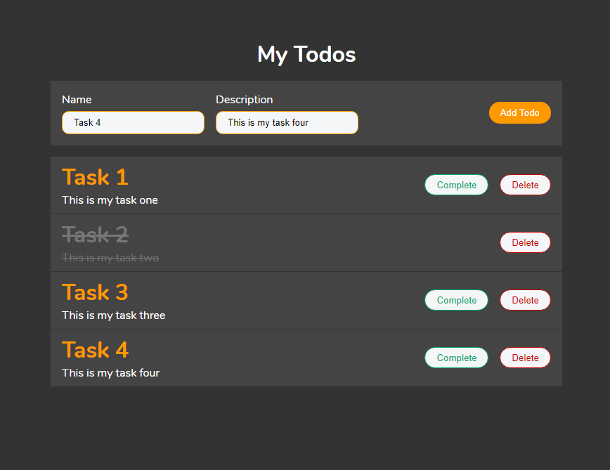

# todo-MERN-server
> This repository demonstrates a todo web app server stack developed using Node.js, Mongo, Express written in TypeScript.

## References

1. Tutorial (<https://www.freecodecamp.org/news/how-to-build-a-todo-app-with-react-typescript-nodejs-and-mongodb>)